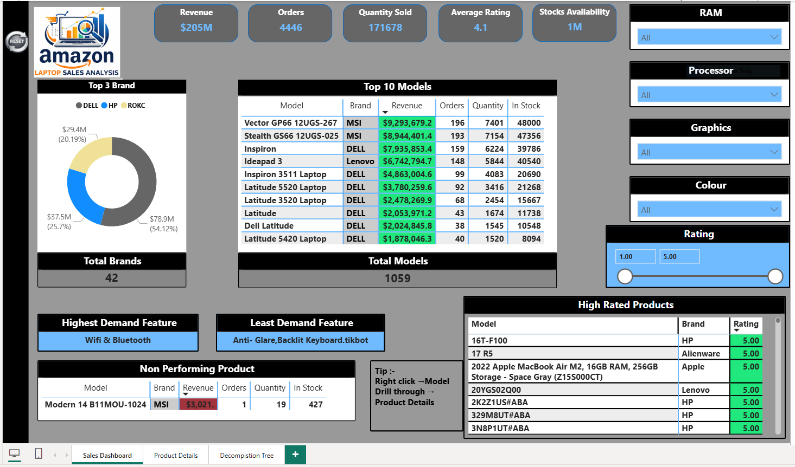
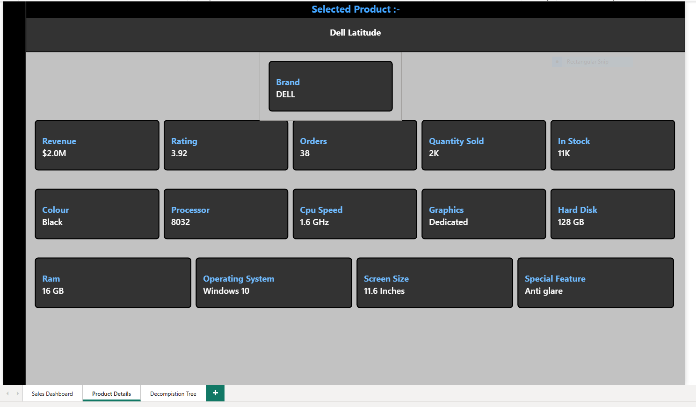

# 📊 Amazon Laptop Sales Analysis Dashboard (Power BI)

An interactive Power BI dashboard designed to analyze Amazon laptop sales data.
This project focuses on extracting meaningful business insights from raw data using data modeling, DAX, and visualization techniques.

---

## 🚀 Project Overview

This dashboard provides a comprehensive analysis of laptop sales performance across different brands, models, and product features. It helps identify high-performing products, customer preferences, and areas of improvement.

---

## 📸 Dashboard Preview

---

## 🎯 Key Features

* 📌 KPI Metrics:

  * Total Revenue
  * Total Orders
  * Quantity Sold
  * Average Rating
  * Stock Availability

* 📊 Product Analysis:

  * Top 3 Brands by Revenue
  * Top 10 Models by Sales
  * High Rated Products

* 🔍 Feature Insights:

  * Highest Demand Feature
  * Least Demand Feature
  * Revenue-based Feature Analysis

* 🎯 Advanced Functionality:

  * Drillthrough for Product Details
  * Dynamic Filters (RAM, Processor, Graphics, Colour, Rating)
  * Cleaned data using DAX & Power Query

---

## 🔍 Drillthrough Feature

Users can explore detailed product-level insights:

👉 Right-click on any model →
👉 Select **Drillthrough → Product Details**

This opens a dedicated page showing:

* Product specifications
* Performance metrics
* Inventory details

---

## 💡 Key Insights

* Identified top revenue-generating laptop models
* Compared high demand vs high revenue features
* Highlighted non-performing products
* Analyzed impact of customer ratings on sales

---

## 🛠️ Tools & Technologies

* Power BI
* DAX (Data Analysis Expressions)
* Power Query
* Data Modeling

---

## 🧠 Data Preparation

* Handled missing values (Unknown / Null)
* Created calculated columns for clean display
* Applied filters and transformations for accurate analysis

---

## 📂 Files Included

* `.pbix` file (Power BI Dashboard)
* Dataset (if included)
* README.md

---

## 🎯 Skills Demonstrated

* Data Visualization
* Dashboard Design
* DAX Calculations
* Data Cleaning
* Business Insight Generation

---

## 🙌 Author

**Hemendra Kumar**

---

## ⭐ If you found this project useful

Give it a ⭐ on GitHub and feel free to connect!
